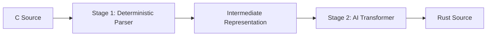

# Project Architecture: C to Rust Translation Pipeline

This document serves as the comprehensive single source of truth for the project's architecture, model layers, and design specifications.
Update this whenever you make a change

## 1. Pipeline Overview

The system implements a two-stage translation pipeline designed to convert C source code into safe Rust code.

- **Stage 1 (C → IR)**: Deterministic, rule-based parser that converts C source into a semantic Intermediate Representation (S-expression).
- **Stage 2 (IR → Rust)**: AI-based syntactic translation from IR to final Rust source code using a Transformer model.

---

## 2. Core Transformer Architecture

Both stages share a common Transformer core defined in `src/model/transformer.py`.

### 2.1 Model Configuration (`TransformerConfig`)
| Hyperparameter | Value | Description |
| :--- | :--- | :--- |
| `d_model` | 512 | Embedding and hidden state dimension |
| `n_heads` | 8 | Number of attention heads |
| `n_layers` | 6 | Number of stacked encoder and decoder layers |
| `d_ff` | 2048 | Inner dimension of the feed-forward network |
| `vocab_size` | 8000 | Maximum vocabulary size |
| `max_seq_len` | 512 | Maximum sequence length (tokens) |
| `dropout` | 0.1 | Dropout rate for all layers |
| `pad_idx` | 0 | Padding token index |

### 2.2 Layer Breakdown

#### Encoder Layer (`TransformerEncoderLayer`)
1. **Multi-Head Self-Attention**: 
   - $Q, K, V$ projections (Linear 512 → 512).
   - Scaled Dot-Product Attention ($d_k = 64$).
2. **Residual Connection & Layer Norm**: $x = \text{Norm}(x + \text{Dropout}(\text{MHA}(x)))$.
3. **Feed-Forward Network**:
   - Linear (512 → 2048) -> GELU -> Dropout -> Linear (2048 → 512).
4. **Residual Connection & Layer Norm**: $x = \text{Norm}(x + \text{Dropout}(\text{FFN}(x)))$.

#### Decoder Layer (`TransformerDecoderLayer`)
1. **Masked Multi-Head Self-Attention**: Prevents attending to future tokens.
2. **Residual Connection & Layer Norm**.
3. **Multi-Head Cross-Attention**: Attends to Encoder memory (memory $K, V$).
4. **Residual Connection & Layer Norm**.
5. **Feed-Forward Network**.
6. **Residual Connection & Layer Norm**.

---

## 3. Stage 1: GIMPLE-based Deterministic Parser

This stage uses GCC's internal IR (GIMPLE) as the source of truth for C semantics.

### 3.1 Pipeline Flow
1. **GCC Dump**: `gcc -fdump-tree-gimple` generates a three-address code representation of the C source.
2. **GIMPLE Parser (`src/tools/gimple_parser.py`)**: A Python-based parser converts the GCC text dump into our target S-expression format.

### 3.2 Benefits
- **Full Compiler Fidelity**: Captures every calculation, pointer offset, and implicit cast exactly as the compiler sees it.
- **Deterministic**: Guarantees consistent IR generation for any valid C code.
- **Improved Learning**: By providing lower-level, more explicit operations (like pointer arithmetic for array access), the Stage 2 model can learn translation patterns more effectively.

---

## 4. Stage 2: IR to Rust Model (`src/model/ir_to_rust_model.py`)

A pure Transformer implementation focused on mapping IR syntax to Rust syntax.

- **Architecture**: Standard `EncoderDecoder` with `TransformerConfig` settings.
- **Output**: Directly predicts the next token in the Rust vocabulary.

---

## 5. Metadata and Persistence

### 5.1 Checkpoint Structure (`.pt` files)
Every checkpoint is a dictionary containing:
- `model_state_dict`: Weights for all model parameters.
- `optimizer_state_dict`: Optimizer states for resuming training.
- `src_vocab`: Dictionary mapping source strings to IDs.
- `tgt_vocab`: Dictionary mapping target strings to IDs.
- `config`: The `TrainingConfig` object used during training.
- `epoch`: Current training epoch.
- `loss`: Validation loss at the time of saving.

### 5.2 Tokenization (`src/tokenizer/c_tokenizer.py`)
- **Tokenizer**: Regex-based, whitespace/comment agnostic.
- **Special Tokens**:
  - `<PAD>` (0): Padding
  - `<UNK>` (1): Unknown word
  - `<BOS>` (2): Beginning of sequence
  - `<EOS>` (3): End of sequence

---

## 6. Execution Flow (Inference)

1. **Input**: Source file (.c or .ir).
2. **Tokenizer**: Encodes text using the **embedded vocabulary** from the checkpoint.
3. **Inference**:
   - **Stage 1**: Generates IR and extracts auxiliary traits from the Encoder memory.
   - **Stage 2**: Generates Rust source tokens.
### 6.2 Tooling and Utilities

- **`modelctl.bat`**: CLI entry point for running individual stage inference.
- **`convert.bat`**: Unified pipeline script to convert a C file to Rust in one go.
  - **Internal Flow**: `Stage 1 (--raw) -> Temp IR -> Stage 2 (--raw) -> Rust Source`.
- **`run_inference.py`**: The core inference driver.
  - **`--raw` Flag**: Suppresses headers, auxiliary traits, and pretty-printing. Used for pipeline chaining.

### 6.3 Performance and Convergence
The models use a fixed vocabulary capacity of 8000. During early training epochs (e.g., loss > 5.0), the model may output `<UNK>` tokens or generic patterns from the training set as it has not yet converged on the translation task.
