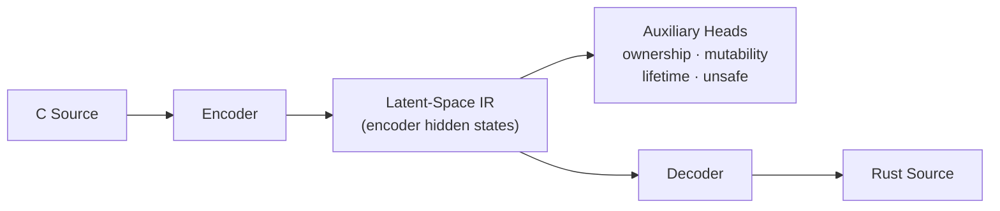

# Project Architecture: C to Rust Translation via Latent-Space IR

This document serves as the comprehensive single source of truth for the project's architecture, model layers, and design specifications.
Update this whenever you make a change

## 1. Pipeline Overview

The system implements a **single-stage** translation pipeline that converts C source code into Rust code. Instead of producing an explicit symbolic intermediate representation, the encoder's hidden states form a **latent-space IR** — a continuous, learned representation that implicitly captures the same semantic information (types, ownership, mutability, lifetimes, unsafe boundaries) that a hand-designed IR would encode.

Auxiliary classification heads applied to this latent space encourage it to learn structured, IR-like features without ever materialising discrete S-expression tokens.



### Why Latent-Space IR?

| Aspect | Explicit S-expression IR | Latent-Space IR |
| :--- | :--- | :--- |
| Information flow | Discrete tokens — lossy | Continuous vectors — lossless |
| Training signal | Two separate models, error compounds | Single end-to-end model, joint optimisation |
| Semantic structure | Hand-designed grammar | Learned via auxiliary heads |
| Inference cost | Two sequential forward passes | One forward pass |

---

## 2. Core Transformer Architecture

Defined in `src/model/transformer.py`.

### 2.1 Model Configuration (`TransformerConfig`)
| Hyperparameter | Value | Description |
| :--- | :--- | :--- |
| `d_model` | 512 | Embedding and hidden state dimension |
| `n_heads` | 8 | Number of attention heads |
| `n_layers` | 6 | Number of stacked encoder and decoder layers |
| `d_ff` | 2048 | Inner dimension of the feed-forward network |
| `vocab_size` | 8000 | Maximum vocabulary size |
| `max_seq_len` | 512 | Maximum sequence length (tokens) |
| `dropout` | 0.1 | Dropout rate for all layers |
| `pad_idx` | 0 | Padding token index |

### 2.2 Layer Breakdown

#### Encoder Layer (`TransformerEncoderLayer`)
1. **Multi-Head Self-Attention**: 
   - $Q, K, V$ projections (Linear 512 → 512).
   - Scaled Dot-Product Attention ($d_k = 64$).
2. **Residual Connection & Layer Norm**: $x = \text{Norm}(x + \text{Dropout}(\text{MHA}(x)))$.
3. **Feed-Forward Network**:
   - Linear (512 → 2048) -> GELU -> Dropout -> Linear (2048 → 512).
4. **Residual Connection & Layer Norm**: $x = \text{Norm}(x + \text{Dropout}(\text{FFN}(x)))$.

#### Decoder Layer (`TransformerDecoderLayer`)
1. **Masked Multi-Head Self-Attention**: Prevents attending to future tokens.
2. **Residual Connection & Layer Norm**.
3. **Multi-Head Cross-Attention**: Attends to the latent-space IR (encoder memory $K, V$).
4. **Residual Connection & Layer Norm**.
5. **Feed-Forward Network**.
6. **Residual Connection & Layer Norm**.

---

## 3. Unified C → Rust Model (`src/model/c_to_rust_model.py`)

A single encoder-decoder transformer that translates C directly to Rust. The encoder hidden states serve as the **latent-space IR**.

### 3.1 Forward Pass

```
C tokens
    │
    ▼
Encoder (6 × TransformerEncoderLayer)
    │
    ├──► Latent-Space IR (B, T_src, 512)
    │         │
    │         ├── OwnershipClassifier   → (B, T_src, 4)
    │         ├── MutabilityClassifier  → (B, T_src, 2)
    │         ├── LifetimeClassifier    → (B, T_src, 4)
    │         └── UnsafeClassifier      → (B, T_src, 2)
    │
    ▼
Decoder (6 × TransformerDecoderLayer) + Output Projection
    │
    ▼
Rust token logits (B, T_tgt, vocab_size)
```

### 3.2 Loss Function

$$\mathcal{L} = \mathcal{L}_{\text{main}} + \lambda \cdot \mathcal{L}_{\text{aux}}$$

- $\mathcal{L}_{\text{main}}$: Cross-entropy between predicted Rust tokens and ground truth (with label smoothing 0.1).
- $\mathcal{L}_{\text{aux}}$: Mean of the four auxiliary cross-entropy losses (ownership, mutability, lifetime, unsafe).
- $\lambda = 0.1$: Auxiliary loss weight.

---

## 4. Auxiliary Heads on the Latent Space (`src/model/multitask_head.py`)

These heads shape the encoder's latent representation to capture Rust-specific semantics:

| Head | Classes | Purpose |
|------|---------|---------|
| `OwnershipClassifier` | owned, borrowed, borrowed\_mut, raw\_ptr | Infer Rust ownership model |
| `MutabilityClassifier` | immutable, mutable | Track `mut` annotations |
| `LifetimeClassifier` | static, local, parameter, heap | Lifetime origin |
| `UnsafeClassifier` | safe, unsafe | Flag unsafe operations |

Each head is a single linear projection from the latent space: `Linear(d_model → n_classes)`.

---

## 5. Metadata and Persistence

### 5.1 Checkpoint Structure (`.pt` files)
Every checkpoint is a dictionary containing:
- `model_state_dict`: Weights for all model parameters.
- `optimizer_state_dict`: Optimizer states for resuming training.
- `src_vocab`: Dictionary mapping source strings to IDs.
- `tgt_vocab`: Dictionary mapping target strings to IDs.
- `config`: The `TrainingConfig` object used during training.
- `epoch`: Current training epoch.
- `loss`: Validation loss at the time of saving.

### 5.2 Tokenization (`src/tokenizer/c_tokenizer.py`)
- **Tokenizer**: Regex-based, whitespace/comment agnostic.
- **Special Tokens**:
  - `<PAD>` (0): Padding
  - `<UNK>` (1): Unknown word
  - `<BOS>` (2): Beginning of sequence
  - `<EOS>` (3): End of sequence

---

## 6. Execution Flow (Inference)

1. **Input**: C source file (`.c`).
2. **Tokenizer**: Encodes text using the **embedded vocabulary** from the checkpoint.
3. **Inference**: The unified model encodes C → latent-space IR → decodes to Rust in a single forward pass. Auxiliary heads can be queried to inspect the latent-space predictions.
4. **Output**: Rust source code.

### 6.1 Tooling and Utilities

- **`modelctl.bat`**: CLI entry point for running inference.
- **`convert.bat`**: Pipeline script to convert a C file to Rust.
- **`run_inference.py`**: The core inference driver.
  - **Stage**: `c2rust` — translates C to Rust via latent-space IR.
  - **`--raw` Flag**: Suppresses headers, auxiliary traits, and pretty-printing. Used for pipeline chaining.

### 6.2 Performance and Convergence
The model uses a fixed vocabulary capacity of 8000. During early training epochs (e.g., loss > 5.0), the model may output `<UNK>` tokens or generic patterns from the training set as it has not yet converged on the translation task.

---

## 7. Self-Play Refinement

```
C source
   │
   ▼
CToRustModel  ──►  cargo check
                        │
            ┌───────────┴────────────┐
         success                   failure
            │                         │
  positive dataset             RustErrorParser
                                       │
                            correction prompt
                                       │
                            negative dataset
```

The self-play loop (`src/training/self_play.py`) translates C samples, validates with `cargo check`, and accumulates positive/negative examples for fine-tuning.
